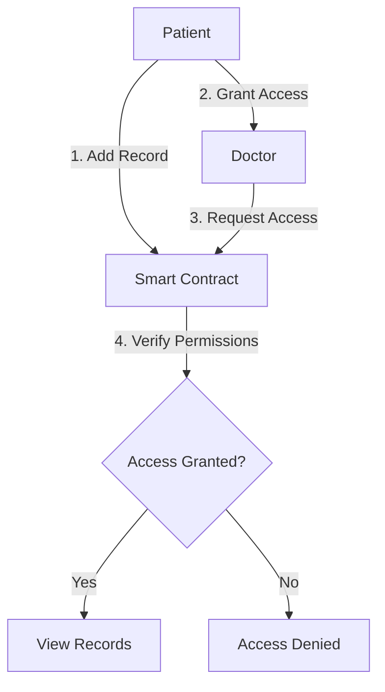

```markdown
# SwasthyaChain: Decentralized Healthcare Records System  
*A Blockchain-Based Electronic Medical Records Solution*  

---

## Table of Contents  
1. [Project Overview](#1-project-overview)  
2. [Technical Architecture](#2-technical-architecture)  
3. [Smart Contract Workflow](#3-smart-contract-workflow)  
4. [User Interfaces](#4-user-interfaces)  
5. [Test Cases](#5-test-cases)  
6. [Security Analysis](#6-security-analysis)  
7. [Weaknesses & Mitigations](#7-weaknesses--mitigations)  
8. [Deployment Guide](#8-deployment-guide)  

---

## 1. Project Overview  

### Problem Statement  
Centralized healthcare systems suffer from:  
- **Data Silos**: Inability to share records across institutions  
- **Lack of Patient Control**: Patients cannot manage who accesses their data  
- **Security Risks**: Single points of failure for sensitive data  

### Solution  
SwasthyaChain leverages **Ethereum smart contracts** to:  
- Give patients full ownership of their medical records  
- Enable granular access control via blockchain permissions  
- Provide immutable audit logs of all access events  

---

## 2. Technical Architecture  

### Smart Contract Components  
```solidity
// SPDX-License-Identifier: MIT
pragma solidity ^0.8.0;

contract SwasthyaChain {
    struct Patient {
        address id;
        string name;
        string[] medicalRecords;
    }
    
    mapping(address => Patient) public patients;
    mapping(address => mapping(address => bool)) public accessPermissions;
    
    function grantAccess(address _doctor) public {
        accessPermissions[msg.sender][_doctor] = true;
    }
}
```

### Key Features  
| Component | Purpose |  
|-----------|---------|  
| `patients` mapping | Stores patient records linked to Ethereum addresses |  
| `accessPermissions` | Tracks which doctors can access which records |  
| Events | Logs all critical actions (e.g., `AccessGranted`) |  

---

## 3. Smart Contract Workflow  



**Steps Explained**:  
1. Patient adds medical records to their profile  
2. Patient grants access to specific doctors via public keys  
3. Doctor requests record access  
4. Smart contract verifies permissions before allowing access  

---

## 4. User Interfaces  

### Patient Dashboard  

)  
- **Features**:  
  - View/Add medical records  
  - Manage doctor access permissions  
  - Public key-based access control  

### Doctor Access View  

)  
- **Key Actions**:  
  - Request record access  
  - View permitted records  

---

## 5. Test Cases  

| Scenario | Steps | Expected Result |  
|----------|-------|----------------|  
| Grant Access | 1. Patient enters doctor's public key<br>2. Clicks "Grant Access" | Doctor appears in access list |  
| Revoke Access | 1. Click "Revoke" next to doctor's address | Doctor removed from access list |  
| Unauthorized Access | Doctor tries to view records without permission | Transaction reverted |  

---

## 6. Security Analysis  

### Strengths  
✔ **Decentralization**: No single point of failure  
✔ **Immutability**: All access events permanently logged  
✔ **Transparency**: Patients see exactly who accessed their data  

### Vulnerabilities  
| Risk | Severity | Mitigation |  
|------|----------|------------|  
| Public key usability | Medium | Integrate ENS domains |  
| On-chain data exposure | High | Store encrypted data on IPFS |  

---

## 7. Weaknesses & Mitigations  

| Weakness | Current Impact | Proposed Solution |  
|----------|---------------|-------------------|  
| Unreadable public keys | Poor UX | Implement ENS naming |  
| No data encryption | Privacy risk | Hybrid IPFS+Blockchain storage |  
| Gas costs | Expensive for patients | Layer 2 solutions (Polygon) |  

---

## 8. Deployment Guide  

### Requirements  
- Node.js v18+  
- Hardhat  
- MetaMask wallet  

### Steps  
1. Clone repository:  
   ```bash
   git clone https://github.com/SuyashMore/SwasthyaChain.git
   ```
2. Install dependencies:  
   ```bash
   npm install
   ```
3. Deploy to Sepolia testnet:  
   ```bash
   npx hardhat run scripts/deploy.js --network sepolia
   ```

