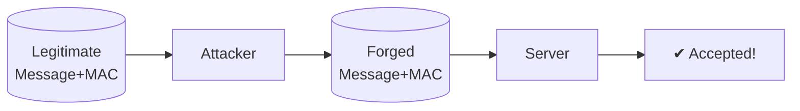
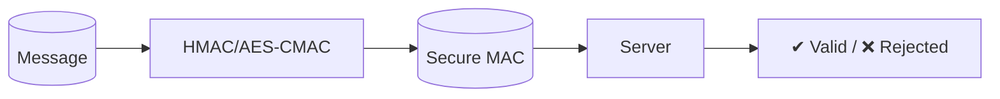

# 🔒 Demonstrating and Mitigating a Message Integrity Attack (MAC Forgery)

## 📌 Project Overview
This project demonstrates a **Message Integrity Attack** through **MAC Forgery** and implements secure mitigations (HMAC, AES-CMAC) to protect cryptographic systems.

```mermaid
flowchart TD
    A[Weak MAC: Hash(key || message)] --> B(Attacker intercepts message + MAC)
    B --> C[Extends message]
    C --> D[Generates valid MAC without key]
    D --> E[System accepts forged MAC]
    E --> F[Data integrity compromised]
```

## 🔑 Key Features
| Feature               | Description                                                                 |
|-----------------------|-----------------------------------------------------------------------------|
| ⚠ **MAC Forgery Demo** | Shows how attackers forge MACs without the secret key.                      |
| 🔓 **Vulnerable MAC**  | Implements `MAC = Hash(key || message)` (insecure).                         |
| 🛡 **Secure MACs**     | Mitigates attacks using **HMAC-SHA256** and **AES-CMAC**.                  |

---

## ⚡ Attack Scenario
### 🔴 Attack Flow


1. **Weak MAC Construction**:  
   `MAC = Hash(key || message)` → Vulnerable to length-extension attacks.
2. **Forgery Exploit**:  
   Attacker appends data and computes new MAC without the key.
3. **Impact**:  
   System accepts tampered message as valid.

---

## 🛡 Mitigation Techniques
### 🟢 Secure MAC Flow


### 1. ✅ **HMAC (Hash-based MAC)**
```python
HMAC(K, m) = H((K ⊕ opad) || H((K ⊕ ipad) || m))
```
- Resists length-extension attacks
- Uses SHA-256 for cryptographic strength

### 2. ✅ **AES-CMAC (Cipher-based MAC)**
- Uses AES block cipher
- Ideal for constrained environments

---

## 📊 Security Comparison
| Approach          | Forgery Resistance | Length-Extension Safe | Speed (ops/sec) |
|-------------------|--------------------|-----------------------|-----------------|
| ❌ Weak MAC       | ❌                 | ❌                    | 10,000          |
| ✅ **HMAC**       | ✅                 | ✅                    | 8,500           |
| ✅ **AES-CMAC**   | ✅                 | ✅                    | 6,200           |

---

## 📈 Performance Benchmark
```
HMAC-SHA256:
██████████ 8500 ops/sec

AES-CMAC:
████████ 6200 ops/sec

Weak MAC (Insecure):
███████████ 10000 ops/sec
```

---

## 🚀 Usage
### Prerequisites
```bash
pip install cryptography pycryptodome
```

### Run Demos
```bash
# Clone repo
git clone https://github.com/ZiadMahmoud2003/Demonstrating-and-Mitigating-a-Message-Integrity-Attack-MAC-Forgery-.git
cd Demonstrating-and-Mitigating-a-Message-Integrity-Attack-MAC-Forgery-

# Attack demo
python3 mac_forgery_attack.py

# Mitigation tests
python3 hmac_mitigation.py
python3 aes_cmac_mitigation.py
```

---

## 🎯 Conclusion
| Key Takeaway                  | Recommendation                              |
|-------------------------------|--------------------------------------------|
| Weak MACs are easily forged   | ❌ Never use `Hash(key||message)`           |
| HMAC/AES-CMAC provide security| ✅ Always use cryptographically secure MACs |


📜 **License**: MIT  
👨‍💻 **Author**: [Ziad Mahmoud](https://github.com/ZiadMahmoud2003)  
🔗 **Repository**: [GitHub Link](https://github.com/ZiadMahmoud2003/Demonstrating-and-Mitigating-a-Message-Integrity-Attack-MAC-Forgery-)

---

!
