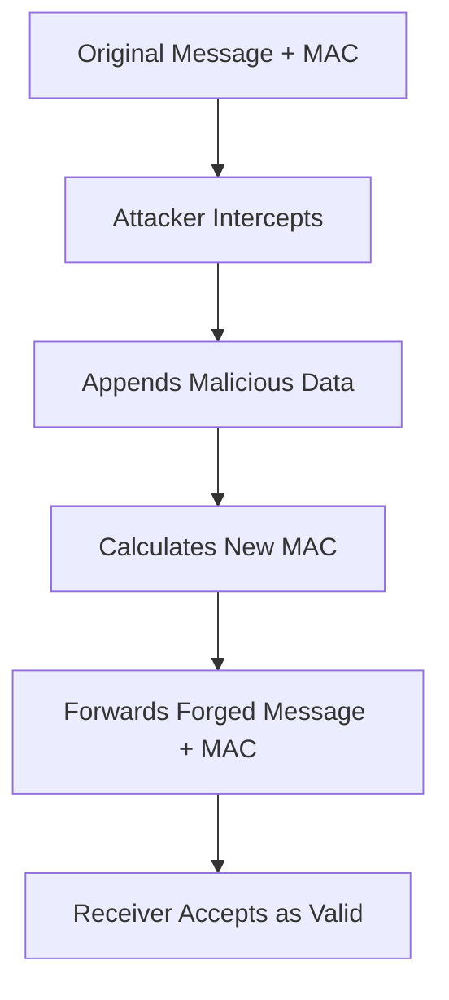
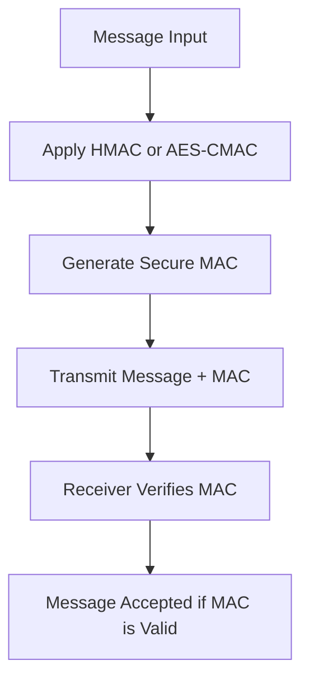

---

# Demonstrating and Mitigating a Message Integrity Attack (MAC Forgery)

## 📌 Project Overview

This project illustrates how Message Authentication Code (MAC) forgery attacks can compromise message integrity and demonstrates effective cryptographic mitigations. By simulating real-world attack scenarios and implementing secure MAC schemes like HMAC and AES-CMAC, it provides a hands-on understanding of message integrity threats and defenses.

---

## 🔍 Attack Scenario: MAC Forgery

The project showcases a length extension attack on an insecure MAC construction, specifically one that uses `Hash(key || message)`. In this setup, an attacker can append data to a legitimate message and generate a valid MAC without knowing the secret key.

### Attack Flow Diagram



This diagram illustrates how an attacker can exploit the MAC construction to forge messages that are accepted by the receiver.([Wikipedia][1])

---

## 🛡️ Mitigation Strategies

To counteract MAC forgery attacks, the project implements two robust MAC schemes:

### 1. HMAC (Hash-based Message Authentication Code)

HMAC enhances security by incorporating the key into the hashing process in a more secure manner. It is defined as:([Brian Wigginton][2])

```

HMAC(key, message) = Hash((key ⊕ opad) || Hash((key ⊕ ipad) || message))
```


This structure prevents length extension attacks by hashing the key and message in a specific way that binds them securely.([ctftime.org][3])

### 2. AES-CMAC (Cipher-based Message Authentication Code)

AES-CMAC uses the AES block cipher to generate a MAC, providing strong security guarantees. It is particularly resistant to forgery attacks due to its block cipher foundation.([Wikipedia][1])

### Mitigation Flow Diagram



This diagram demonstrates the process of securing a message using HMAC or AES-CMAC, ensuring that any tampering is detected by the receiver.

---

## 🧪 Project Components

* **`client.py`**: Simulates a client sending messages with MACs.
* **`server.py`**: Represents a server verifying MACs using insecure methods.
* **`server_hmac.py`**: A secure server implementation using HMAC.
* **`gui.py`**: Provides a graphical interface to interact with the client and servers.
* **`pymd5.py`**: Contains a custom implementation of the MD5 hashing algorithm.
* **`requirements.txt`**: Lists Python dependencies for the project.
* **`Background_Report.pdf`**: Offers an in-depth explanation of MAC forgery attacks.
* **`mitigation.pdf`**: Details the mitigation techniques implemented in the project.([Wikipedia][1], [stinger.io][4])

---

## 🚀 Getting Started

### Prerequisites

* Python 3.x
* Install required packages:([stinger.io][4])

```bash
pip install -r requirements.txt
```


### Running the Project

1. Start the insecure server:

   ```bash
   python server.py
   ```


2. Start the secure server with HMAC:([ctftime.org][3])

   ```bash
   python server_hmac.py
   ```


3. Launch the client GUI:

   ```bash
   python gui.py
   ```


Use the GUI to send messages and observe how the insecure server is vulnerable to MAC forgery, while the secure server correctly identifies and rejects forged messages.


---

## 📚 References

* [Message Authentication Code - Wikipedia](https://en.wikipedia.org/wiki/Message_authentication_code)
* [HMAC - Wikipedia](https://en.wikipedia.org/wiki/HMAC)
* [AES-CMAC - NIST Special Publication 800-38B](https://nvlpubs.nist.gov/nistpubs/Legacy/SP/nistspecialpublication800-38b.pdf)([Wikipedia][1])

---
